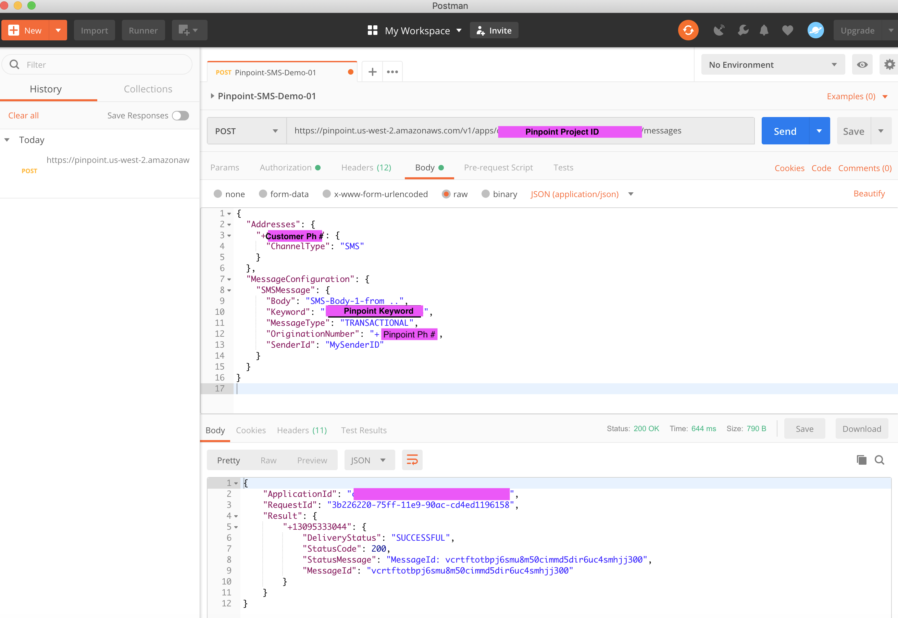

# pinpoint-with-postman -- samplen

-- Configure Postman with AWS Creds - API Key, API Secret, Region.  Ensure that the credential has privileges to execute Pinpoint APIs




```
{
  "Addresses": {
    "+1<<Customer US Phone Number>>": {
      "ChannelType": "SMS"
    }
  },
  "MessageConfiguration": {
    "SMSMessage": {
      "Body": "SMS-Body-1-from ..",
      "Keyword": "<<Pinpoint Keyword>>",
      "MessageType": "TRANSACTIONAL",
      "OriginationNumber": "+1<<Pinpoint US Phone Number>>",
      "SenderId": "MySenderID",
      "Substitutions":{}
    }
  }
}
```
